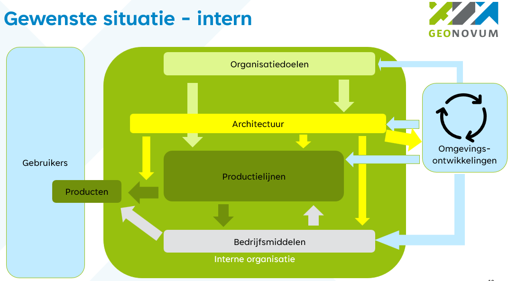

# Welkom

Welkom bij de dynamische architectuurpagina van Geonovum. Uit [beleidskaders](beleidskaders/index.md) (beleidsvisie, beleidsplan, doelstelling, handboeken, BOMOS) komen we tot formulering van [architectuurprincipes](architectuurprincipes/index.md). Deze
principes werken we verder uit tot [implicaties](implicaties/index.md) voor hoe wij onze infrastructuur inregelen.

Beslissingen die we nemen met impact op architectuure documenten we in ['Architecure Decision Records' (ADRs)](adr/index.md).

Onze architectuur beschrijft alle producten van Geonovum. Dit zijn:

- Adviezen
- Standaarden
- Informatie op onze website
- Validators
- Dienstverlening aan andere projecten.

## Uitgangspunten

Onze architectuur:

- Volgt de organisatiedoelen.
- Legt kaders op aan onze  productielijnen en de wijze waarop onze producten worden gemaakt.
- Legt kaders op aan de bedrijfsmiddelen.

## Doelstellingen

Met de globale architectuurschets (GAS) borgen (en waar mogelijk: verhogen) we de kwaliteit van en samenhang tussen de standaarden die we bij Geonovum ontwikkelen en beheren en
zorgen we ervoor dat de architectuur invulling geeft aan de beleidskaders van Geonovum

## Gebruikte materialen:

- I&A Beleidsplan van Geonovum
- Handboek beheer Geonovum  (Generiek beheren van standaarden bij Geonovum)
- Beheer basis geostandaarden
- Beleidsvisie
- BOMOS
- DSGO - richtinggevende principes
- Kernwaarden dienstverleing NORA
- GAS van DSO
- GAS van BRO
- <https://provincienh.github.io/architectuurprincipes/>
